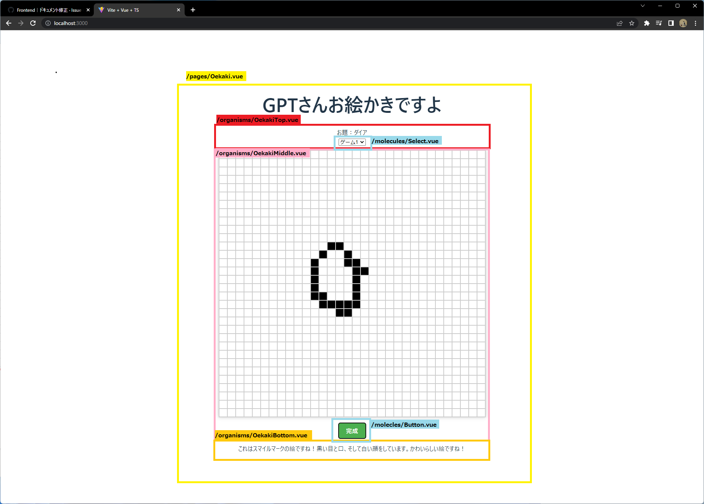
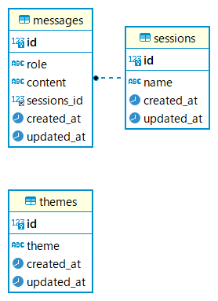
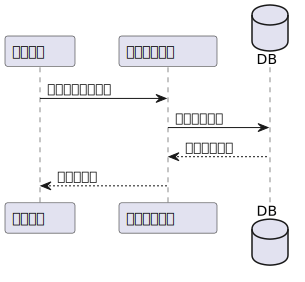
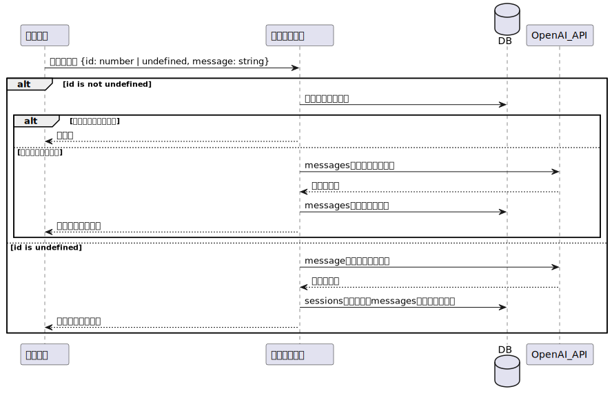

# GPTさんお絵かきですよ

OpenAI Chat(gpt3.5)に対して「`0と1で構成された32*32の文字列` `0は白、1は黒`」というルールでプロンプトを発行し、描かれた絵を言い当てることができるかを試すゲーム

---
## 期待できる活用方法
OpenAI APIをターゲットに、リクエストを送信するためのProxyサーバーとして機能するサービスである。  
本プロジェクトをベースとして用いることで、以下の機能を実現することが可能になる。
- ユーザーインターフェイスが自由に選択可能。（例えば、本プロジェクトフロントエンドのお絵かき画面、Slack、Line）
- ユーザーのやり取りを保持・分析が可能。
- 機密情報などの送信を防ぐためのマスク処理機能を持たせることが可能。

---
## 設定方法

### Frontend (vue-cli/Vite)
- (初回のみ)`/frontend-vue3`ディレクトリ内で、`npm ci`を実行
- `npm run dev`を実行

### Frontend (SDKバージョン)
- `npm i -g http-server` を実行してhttp-serverをインストール。
- `/frontend` ディレクトリ内で `http-server` を実行。

### Backend
- `Docker Desktop` をインストール。
- `/backend` ディレクトリ内で `docker compose up -d` を実行。
- (初回のみ)`/backend/server/.env.example`から.envをコピー。
- (初回のみ)`/backend/server/.env`内部に適切なクレデンシャル情報を入力する。
- (初回のみ)`docker exec -it server sh` でコンテナ内に入る。
- (初回のみ)データベースセットアップのため、`npx prisma migrate` `npx prisma generate dev` `npm run seed` を実行。
- OpenAI Chat のシステム設定を変更したい場合は、`/backend/server/.env` ファイルの `OPENAI_CHAT_SYSTEM_MESSAGE` を変更する。

---
## Frontend Disign

### コンポーネント

---
## Database Design

### ER図

---
## Backend Design

### API概要

| API名 | 概要 |
|-------|------|
| HealthCheck | API状態確認用エンドポイント(兼マルチプロセス検証用) |
| Themes | 出題されるお題に関するAPI |
| Sessions | 過去のゲーム一覧に関するAPI |
| Session | 一回のゲームに関するAPI |

### エンドポイント一覧

#### HealthCheck
| エンドポイント | リクエストタイプ | パラメーター | レスポンス |
|--------------|--------------|-----------|---------|
| `/` | `GET` | `-` | "OK" |
| `/fibonacci/:n` | `GET` | `-` | "{   "result": number   }" |

| エンドポイント | リクエストタイプ | パラメーター | レスポンス |
|--------------|--------------|-----------|---------|
| `/sessions` | `GET` | `-` | {   "sessions": {   "id": number,   "name": string,   "created_at": Date,   "updated_at": Date \| null    } []   } |

#### Sessions

| エンドポイント | リクエストタイプ | パラメーター | レスポンス |
|--------------|--------------|-----------|---------|
| `/sessions` | `GET` | `-` | {   "sessions": {   "id": number,   "name": string,   "created_at": Date,   "updated_at": Date \| null    } []   } |

#### Session

| エンドポイント | リクエストタイプ | パラメーター | レスポンス |
|--------------|--------------|-----------|---------|
| `/session/:id` | `GET` | `PathParam=id` | {   "session": {   "id": number,   "name": string,   "messages": {   "id": number,   "message": string,   }[],   "created_at": Date,   "updated_at": Date \| null    }   } |
| `/session` | `POST` | {   "id": number \| undefined,   "message": string  } | {   "session": {  "id": number,   "name": string,   "response": string,    }   } |

#### Themes

| エンドポイント | リクエストタイプ | パラメーター | レスポンス |
|--------------|--------------|-----------|---------|
| `/themes` | `GET` | `-` | {  "getThemes" : [   "id": number,  "theme": string,   "created_at": Date,   "updated_at": Date,    ] } |

---
#### GetSessions 

---
#### GetSession

---
#### PostSession

---
#### GetTheme

