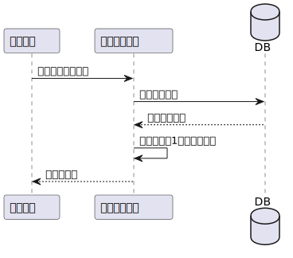

# GPTsanOekakidesuyo

---
## Backend Design

## API概要

| API名 | 概要 | ドキュメントリンク |
|-------|------|------------------|
| Themes | 出題されるお題に関するAPI | [API1ドキュメント](リンク) |
| Sessions | 1回毎のゲームに関するAPI | [API2ドキュメント](リンク) |

## エンドポイント一覧

### Themes

| エンドポイント | リクエストタイプ | パラメーター | レスポンス |
|--------------|--------------|-----------|---------|
| `/themes` | `GET` | `` | {  "getThemes" : [   "id": number,  "theme": string,   "created_at": Date,   "updated_at": Date,  ] } |

### Sessions

| エンドポイント | リクエストタイプ | パラメーター | レスポンス |
|--------------|--------------|-----------|---------|
| `/sessions` | `GET` | `` | `{  "": "value1",   "key2": "value2"  }` |
| `/sessions` | `POST` | `{   "session": {  "id": number \| undefined,   "message": string  }  }` | `{  "key1": "value1",  "key2": "value2"  }` |

---
### GetTheme

