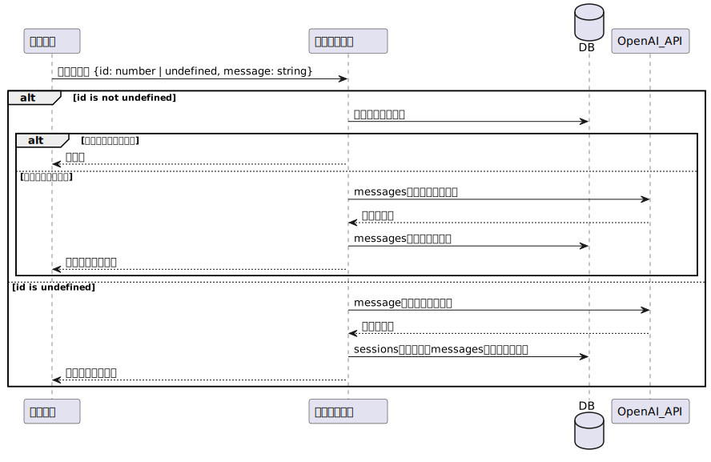

# GPTsanOekakidesuyo

---
## Backend Design

## API概要

| API名 | 概要 | ドキュメントリンク |
|-------|------|------------------|
| Themes | 出題されるお題に関するAPI | [API1ドキュメント](リンク) |
| Sessions | 過去のゲーム一覧に関するAPI | [API2ドキュメント](リンク) |
| Session | 一回のゲームに関するAPI | [API2ドキュメント](リンク) |

## エンドポイント一覧

### Themes

| エンドポイント | リクエストタイプ | パラメーター | レスポンス |
|--------------|--------------|-----------|---------|
| `/themes` | `GET` | `-` | {  "getThemes" : [   "id": number,  "theme": string,   "created_at": Date,   "updated_at": Date,    ] } |

### Sessions

| エンドポイント | リクエストタイプ | パラメーター | レスポンス |
|--------------|--------------|-----------|---------|
| `/sessions` | `GET` | `-` | {   "sessions": {   "id": number,   "name": string,   "created_at": Date,   "updated_at": Date \| null    } []   } |

### Session

| エンドポイント | リクエストタイプ | パラメーター | レスポンス |
|--------------|--------------|-----------|---------|
| `/session/:id` | `GET` | `PathParam=id` | {   "session": {   "id": number,   "name": string,   "messages": {   "id": number,   "message": string,   }[],   "created_at": Date,   "updated_at": Date \| null    }   } |
| `/session` | `POST` | {   "id": number \| undefined,   "message": string  } | {   "session": {  "id": number,   "name": string,   "response": string,    }   } |

---
### GetTheme

### PostSession

